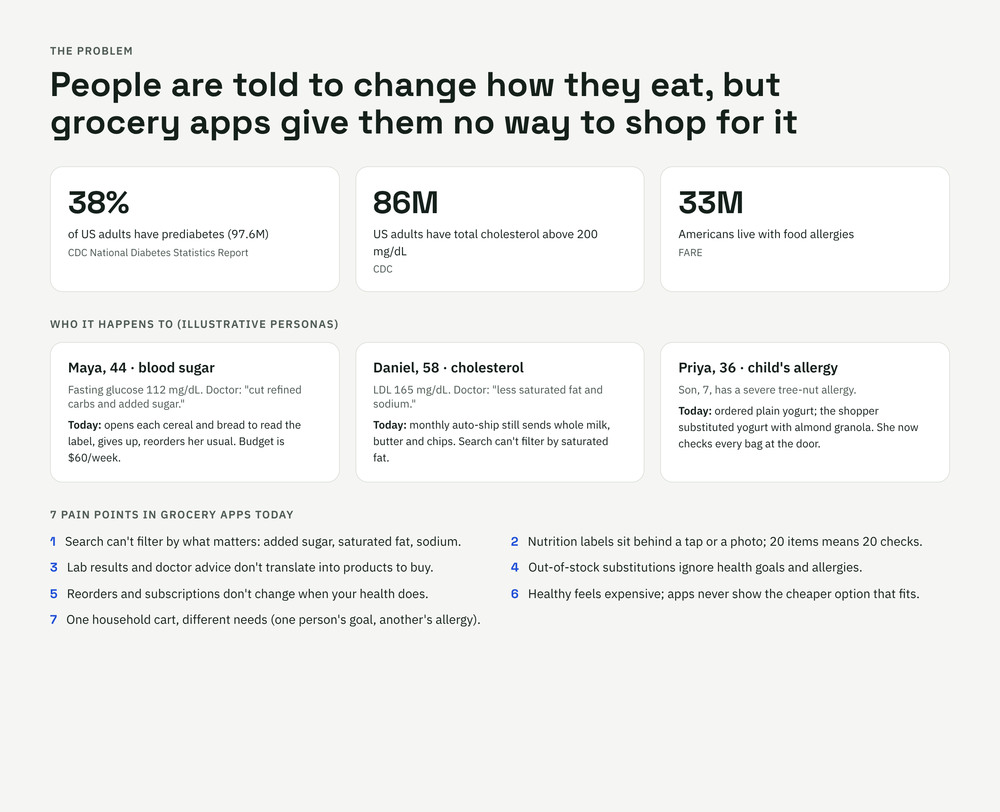
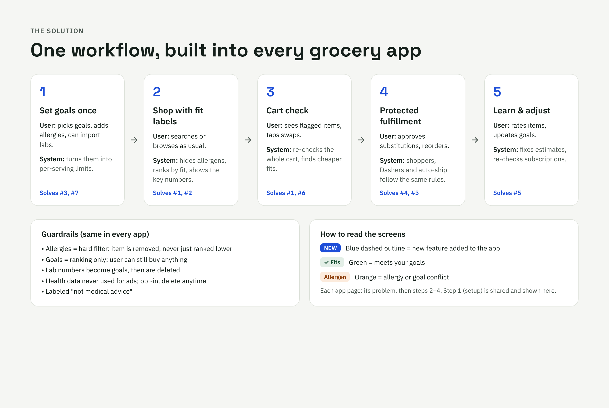
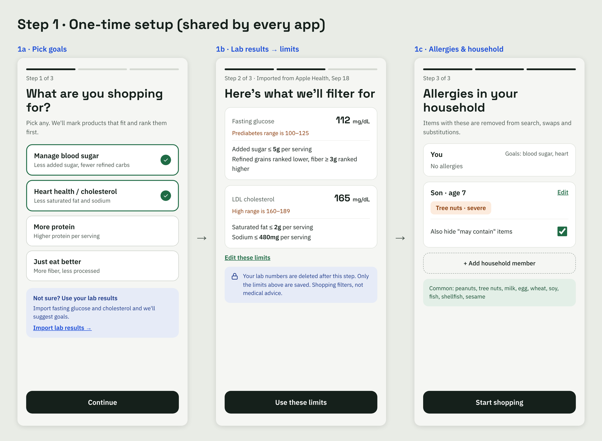
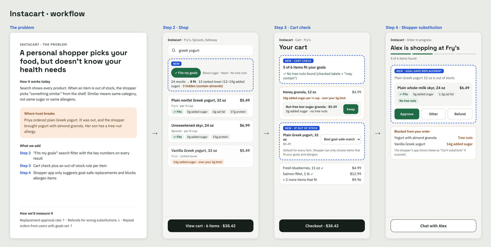
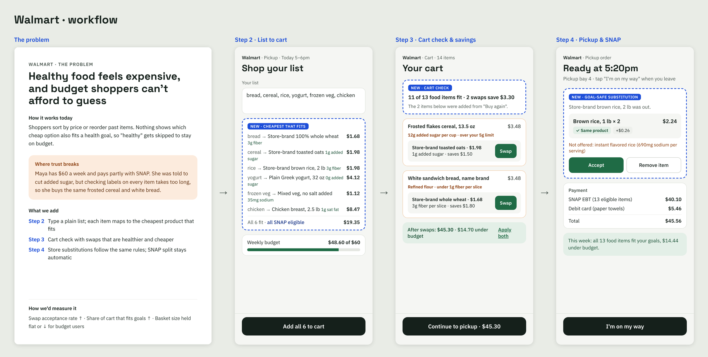
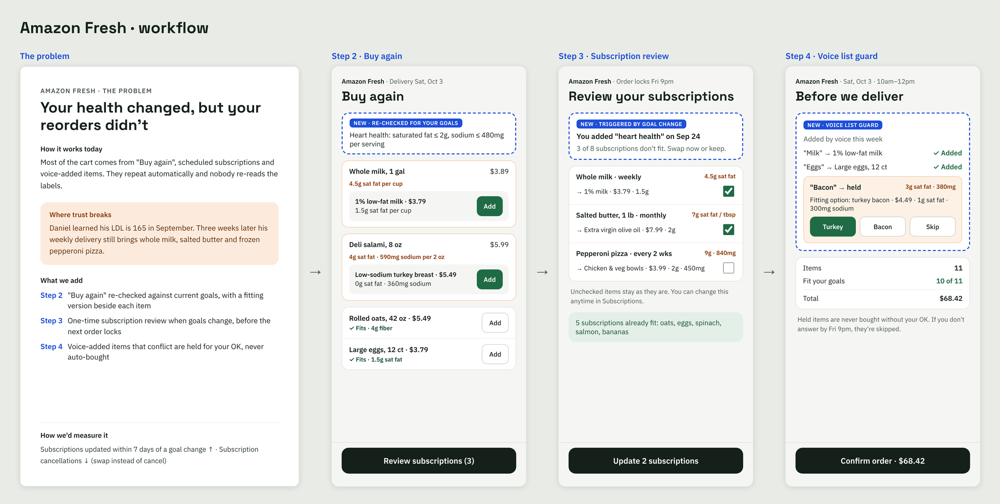
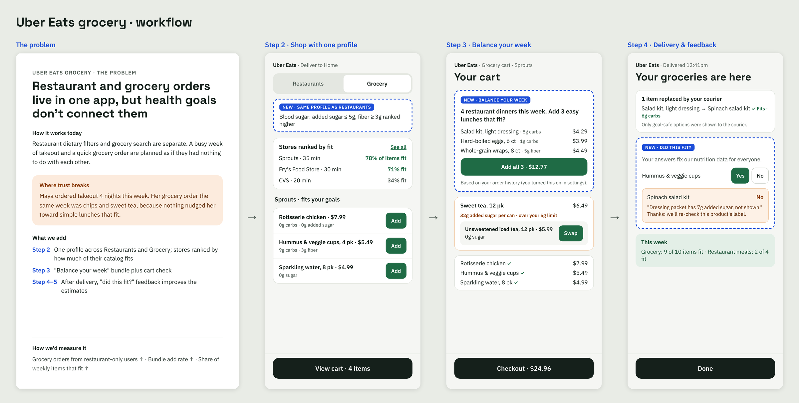
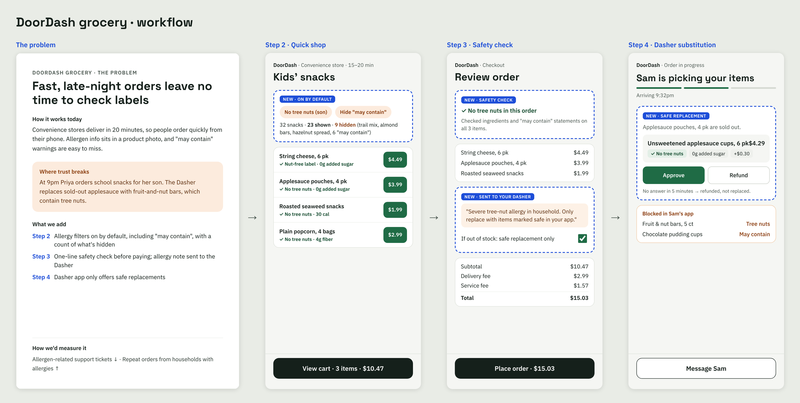

# Health-Aware Grocery Delivery — UX Case Study

**Author:** Roopha · AI Policy Analyst  
**Type:** Product & UX concept (problem → workflow → screens)  
**Apps covered:** Instacart · Walmart · Amazon Fresh · Uber Eats grocery · DoorDash grocery

> This is a concept. It is not affiliated with or endorsed by any of the companies named.

---

## 1. The problem

People are told by their doctor to change how they eat, but grocery delivery apps give them no way to shop for it.

| Who's affected | Scale | Source |
|---|---|---|
| Adults with prediabetes | 38% of US adults (97.6M) | CDC, National Diabetes Statistics Report |
| Adults with high cholesterol | 86M US adults have total cholesterol > 200 mg/dL | CDC |
| People with food allergies | 33M Americans | FARE |

### Personas (illustrative)

| Persona | Health need | What happens in the app today |
|---|---|---|
| **Maya, 44** | Fasting glucose 112 mg/dL. Told to cut added sugar and refined carbs. $60/week budget, uses SNAP. | Opens each cereal and bread to read the label, gives up, reorders her usual. |
| **Daniel, 58** | LDL 165 mg/dL. Told to cut saturated fat and sodium. | Monthly auto-ship still sends whole milk, butter and pepperoni pizza. Search can't filter by saturated fat. |
| **Priya, 36** | Son, 7, has a severe tree-nut allergy. | Ordered plain yogurt; the shopper substituted yogurt with almond granola. |

### 7 pain points

1. Search can't filter by what matters: added sugar, saturated fat, sodium.
2. Nutrition labels sit behind a tap or a photo; 20 items means 20 checks.
3. Lab results and doctor advice don't translate into products to buy.
4. Out-of-stock substitutions ignore health goals and allergies.
5. Reorders and subscriptions don't change when your health does.
6. Healthy feels expensive; apps never show the cheaper option that fits.
7. One household cart, different needs (one person's goal, another's allergy).

---

## 2. The solution: one workflow in every app

| Step | User does | System does | Solves |
|---|---|---|---|
| **1. Set goals once** | Picks goals, adds allergies per household member, can import lab results | Converts goals into per-serving limits | #3, #7 |
| **2. Shop with fit labels** | Searches and browses as usual | Hides allergens, ranks by fit, shows the key numbers on each item | #1, #2 |
| **3. Cart check** | Sees flagged items, taps swaps | Re-checks the whole cart, finds cheaper items that fit | #1, #6 |
| **4. Protected fulfillment** | Approves substitutions and reorders | Shoppers, Dashers and auto-ship follow the same rules | #4, #5 |
| **5. Learn & adjust** | Rates "did this fit?", updates goals | Fixes nutrition estimates, re-checks subscriptions | #5 |

### Step 1 example: lab results → shopping limits

| Lab value | Reference range | Limit applied when shopping |
|---|---|---|
| Fasting glucose 112 mg/dL | Prediabetes 100–125 | Added sugar ≤ 5g per serving; fiber ≥ 3g ranked higher |
| LDL 165 mg/dL | High 160–189 | Saturated fat ≤ 2g per serving; sodium ≤ 480mg per serving |

The user can edit every limit. Raw lab numbers are deleted after this step.

---

## 3. App-by-app workflow

Each app gets the same 5-step workflow. What changes is the moment where that app currently breaks trust.

### Instacart: protect the substitution

- **Problem:** a personal shopper picks replacements by category, not by sugar or allergens.
- **Step 2:** "Fits my goals" search filter. Example: 24 yogurt results → 8 fit, 13 ranked lower (12–19g added sugar), 3 hidden (contain almonds).
- **Step 3:** Cart check plus a per-item "if out of stock" rule (best goal-safe match / specific item / refund).
- **Step 4:** The shopper's app only suggests goal-safe replacements and blocks allergen items from being scanned.
- **Measure:** replacement approval rate ↑, wrong-substitution refunds ↓.

### Walmart: healthy within budget

- **Problem:** healthy food feels expensive, and budget shoppers can't afford to guess.
- **Step 2:** Type a plain list ("bread, cereal, rice…"); each word maps to the cheapest product that fits.
- **Step 3:** Swaps that are healthier *and* cheaper. Example: frosted cereal $3.48 → store-brand toasted oats $1.98 (12g → 1g added sugar).
- **Step 4:** Pickup substitutions follow the same rules; SNAP EBT split stays automatic.
- **Measure:** swap acceptance ↑, share of cart that fits ↑, basket size flat or ↓.

### Amazon Fresh: update what repeats

- **Problem:** health changed, but reorders didn't.
- **Step 2:** "Buy again" re-checked against current goals, with a fitting version next to each item.
- **Step 3:** A goal change triggers a one-time subscription review before the next order locks.
- **Step 4:** Voice-added items that conflict are held for approval and never auto-bought.
- **Measure:** subscriptions updated within 7 days of a goal change ↑, cancellations ↓.

### Uber Eats grocery: one profile for food and grocery

- **Problem:** restaurant and grocery orders live in one app but aren't connected by health goals.
- **Step 2:** The same profile works on Restaurants and Grocery; stores are ranked by % of catalog that fits.
- **Step 3:** "Balance your week" suggests easy lunches after several takeout dinners (opt-in use of order history).
- **Steps 4–5:** Courier substitutions are goal-safe; "Did this fit?" feedback corrects nutrition data.
- **Measure:** grocery orders from restaurant-only users ↑, bundle add rate ↑.

### DoorDash grocery: safe impulse orders

- **Problem:** fast, late-night orders leave no time to check labels.
- **Step 2:** Allergy filters on by default, including "may contain", with a count of hidden items.
- **Step 3:** One-line safety check before paying; an allergy note is sent to the Dasher.
- **Step 4:** The Dasher's app only offers safe replacements. No answer in 5 minutes → refund, not a substitution.
- **Measure:** allergen-related support tickets ↓, repeat orders from allergy households ↑.

---

## 4. Guardrails (same in every app)

- **Allergies = hard filter.** The item is removed, never just ranked lower.
- **Goals = ranking only.** The user can still buy anything.
- **Lab numbers become goals, then are deleted.**
- **Health data is never used for ads.** Opt-in, delete anytime.
- **Labeled "not medical advice."**
- **Privacy & compliance:** sensitive-data rules apply even outside HIPAA (FTC Health Breach Notification Rule, Washington My Health My Data Act, CCPA/CPRA sensitive data).

---

## 5. How the backend changes

| Component | New or changed | Role |
|---|---|---|
| **Health Profile Service** | New, isolated | Stores goals and allergies (not raw lab values), with its own encryption keys, consent log and delete flow |
| **Product data pipeline** | New | Reads nutrition panels and allergen statements from product labels; AI estimates fill gaps, with a confidence score |
| **Rules Engine** | New, deterministic | Applies hard allergen filters and per-serving limits. AI estimates data; rules make the safety decisions |
| **Ranking / search** | Changed | Adds a fit score (and a price-per-fit score for budget shoppers) alongside existing signals |
| **Shopper / Dasher app** | Changed | Replacement scan runs through the Rules Engine; unsafe items show "Can't substitute" |
| **Subscription service** | Changed | A goal change triggers a re-check of recurring orders before they lock |
| **Feedback loop** | New | "Did this fit?" and incident reports correct product data |

**Data flow:** goals & allergies → Health Profile Service → Rules Engine builds constraints → search, cart, substitutions and subscriptions all check against them → feedback improves product data.

---

## 6. Screens in this repo

All images are in [`images/`](images/).

| File | What it shows |
|---|---|
| `00-problem.png` | Problem, scale, personas, 7 pain points |
| `01-workflow.png` | The 5-step workflow, guardrails, how to read the screens |
| `flow-setup.png` | Step 1 setup: goals, lab results → limits, allergies |
| `flow-ic/wm/az/ue/dd.png` | Each app: problem + steps 2–4 side by side |
| `<app>-0..3-*.png` | Each screen on its own (ic = Instacart, wm = Walmart, az = Amazon Fresh, ue = Uber Eats, dd = DoorDash) |

On every screen, new features are outlined with a blue dashed border and a **NEW** tag.

---

*Prices and nutrition values are typical US figures for illustration and vary by store and brand.*
